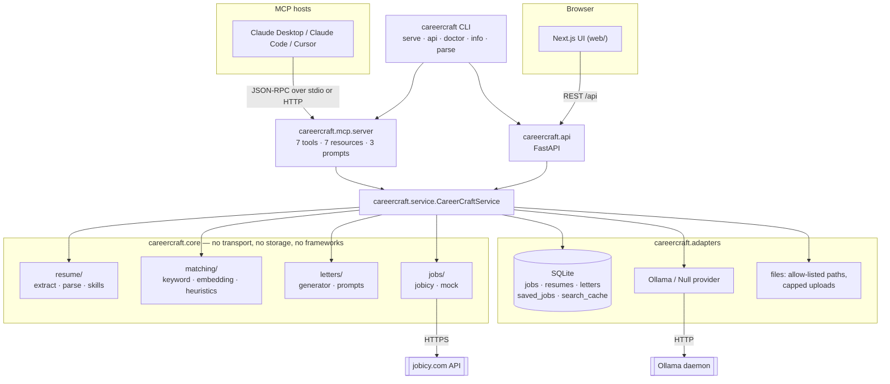

# CareerCraft

An MCP server that turns a resume into targeted job applications — parsing,
matching and cover letters, running entirely on your machine.

[](https://github.com/thompgt/job-mcp-agent/actions/workflows/ci.yml)
[](https://pypi.org/project/careercraft-mcp/)
[](https://pypi.org/project/careercraft-mcp/)
[](LICENSE)

Point Claude Desktop, Claude Code or Cursor at it and ask:

> Read my resume at ~/Documents/cv.pdf, find remote data roles I'd actually be
> competitive for, and tell me what I'm missing for the best one.

---

## Why this matters

Job searching is a document-matching problem that people solve by hand, badly.
A candidate reads a posting, guesses whether they are close enough, rewrites a
cover letter from a template, and repeats it forty times. The parts a computer
is good at — reading a resume, comparing it against a posting's vocabulary,
naming exactly which skills are missing — are the parts nobody automates,
because the tools that do exist have two problems:

- **They want your resume on their server.** A resume is a dossier: full name,
  phone number, home region, employment history, education. Uploading it to a
  SaaS product to get a similarity score is a bad trade. CareerCraft parses it
  on your machine and stores it in a local SQLite file; the only outbound
  request is the job-board search, which sends a query string and nothing else.
  There is no API key, no account and no telemetry.
- **They give you a number, not a reason.** "87% match" is not actionable.
  Every match here reports which of your skills the posting asks for *and which
  it asks for that your resume never mentions*. The second list is the useful
  one: it is the gap between you and the role, in the posting's own words.

The MCP framing is what makes this more than a script. The user already has a
capable model in front of them; what the model lacks is grounded access to
their resume and to live postings. Exposing the pipeline as MCP tools lets the
host model drive the whole loop — parse, rank, explain, draft — while every
factual claim it makes traces back to a tool result rather than to its own
recollection. The cover-letter path leans on this deliberately: when no local
model is available, the tool returns a *grounded brief* (themes, evidence,
company hooks, paragraph plan) and lets the host's much stronger model write
the prose.

---

## Skills demonstrated

**Protocol and agent integration**

- A [Model Context Protocol](https://modelcontextprotocol.io) server built on
  **FastMCP 2.x**: 7 tools, 7 resources and 3 prompts, over both `stdio` and
  streamable HTTP transports.
- Tool schemas derived from Pydantic return types, so `outputSchema` and field
  documentation stay in sync with the code by construction.
- Agent-facing design decisions: server `instructions` that teach the calling
  model the intended tool order; failures raised as `ToolError` (rather than a
  200 with an error-shaped body, which a model reads as success); a
  `careercraft://capabilities` resource so the model stops offering features
  this install cannot perform; MCP progress notifications piped through a
  transport-agnostic callback.
- **stdio purity** as a tested invariant — under stdio, stdout carries JSON-RPC
  frames, so all logging goes to stderr and banners are suppressed
  (`tests/mcp/test_stdio_purity.py`).
- An MCP registry manifest (`server.json`) against the official server schema.

**Python engineering**

- Python 3.10–3.13, fully type-annotated, `mypy --strict` clean, shipping
  `py.typed`.
- Async throughout with **anyio**: blocking work (PDF extraction, spaCy, torch,
  `sqlite3`) is dispatched to worker threads, with CPU-bound scoring funnelled
  through a single-slot `CapacityLimiter` because torch is not reentrant.
- **Hexagonal layering enforced by the linter, not by convention**: a ruff
  `banned-api` rule makes `import fastmcp`, `import fastapi` or `import sqlite3`
  inside `careercraft.core` a lint failure.
- Optional dependencies as a first-class design: the base install is small
  enough to `uvx`, every heavy backend is behind a lazy import plus a runtime
  `find_spec` probe, and the server reports honestly what it can do.
- Pydantic v2 models and **pydantic-settings** for env-driven configuration,
  including CSV-or-JSON list coercion and validation aliases.
- Structured logging with **structlog**; a domain error hierarchy where every
  error carries a machine-readable `code` and a human `remedy`.

**Information retrieval and NLP**

- A from-scratch **TF-IDF cosine** scorer — sub-linear term frequency, smoothed
  IDF fitted over the candidate postings, sparse dict vectors — with no
  scikit-learn dependency.
- Score design informed by observed failures: raw skill coverage rewarded
  sparse postings, so coverage is paired with recall via their **harmonic
  mean**, then blended with text similarity at a fixed weight.
- Optional **sentence-transformers** semantic matching (`all-MiniLM-L6-v2`)
  behind the same interface, with normalised embeddings so the dot product is
  cosine directly.
- Resume parsing: section detection from regex headers *and* PDF font
  size/weight (PyMuPDF layout lines), a curated ~94-entry skill vocabulary with
  alias normalisation, optional spaCy NER for names, optional OCR fallback for
  scanned PDFs.
- Seniority and degree heuristics with word-boundary matching and a
  false-positive phrase list ("Lead Generation Specialist" is not a lead role).

**Web, data and delivery**

- **FastAPI** REST API over the same service object as the MCP server, with
  centralised domain-error-to-status mapping, streamed uploads enforcing a size
  cap as bytes arrive, and optional bearer auth.
- **Next.js 16 / React 19 / TypeScript / Tailwind 4** front end whose types are
  generated from the FastAPI OpenAPI schema (`openapi-typescript`), so a Python
  response-shape change breaks the TS build rather than the user's browser.
- **SQLite** with WAL, `PRAGMA user_version` migrations and content-addressed
  job ids so refetching does not duplicate rows.
- Security posture as code: allow-listed filesystem roots with symlink-resolved
  containment checks, `path=` rejected outright over HTTP, and a startup guard
  that *refuses* a non-loopback bind without an auth token. Scraped posting
  text is fenced and labelled as data before it reaches any model.
- A checked-in `uv.lock` that CI's lint job installs from with `--locked`, so
  the linting toolchain is reproducible and lock drift is a failed check;
  the test matrix still resolves fresh, because that is what proves the
  published package's lower bounds still hold.
- Docker + Compose (loopback-only published ports), pre-commit, and a GitHub
  Actions matrix across 3 OSes × Python 3.10/3.13 — including a base-install-only
  job, since "the extras are optional" is a claim that has to be tested, and a
  `docker` job that builds the image and curls its healthcheck, since "the
  Dockerfile works" is another one.

---

## Architecture

### Models

| Kind | What is used | Where |
|---|---|---|
| **Host LLM** (primary) | Whatever model runs the MCP host — Claude Desktop, Claude Code, Cursor. It drives the tool loop and writes cover letters from a `LetterBrief`. | The MCP client, outside this repo |
| **Local LLM** (optional) | **Ollama**, default `llama3.2:1b`, called over its native `/api/chat` HTTP endpoint. Overridable per call. Set `OLLAMA_BASE_URL=disabled` to turn generation off. | `adapters/llm/ollama.py` |
| **Embedding model** (optional) | sentence-transformers, default **`all-MiniLM-L6-v2`**, cached process-wide. | `core/matching/embedding.py` |
| **NER model** (optional) | spaCy, default **`en_core_web_sm`**, used only to find a candidate name that is not on the first lines. | `core/resume/parse.py` |
| **Statistical model** (always) | TF-IDF vector space fitted over the postings being ranked, blended with skill coverage/recall. No training, no download. | `core/matching/keyword.py` |
| **Domain models** | Pydantic v2, `extra="forbid"`: `Job`, `JobSearchResult`, `ParsedResume` (+ `Contacts`, `EducationEntry`, `ExperienceEntry`, `ProjectEntry`), `ResumeSummary`, `JobMatch`, `MatchResult`, `CoverLetter`, `LetterBrief`, `Capability`/`Capabilities`. These are the tool return types, so their field names *are* the MCP contract. | `models.py` |
| **Storage schema** | SQLite v1: `jobs`, `resumes`, `letters`, `saved_jobs`, `search_cache`. | `adapters/storage/sqlite.py` |
| **Wire schema** | FastAPI OpenAPI → `web/lib/schema.d.ts` via `openapi-typescript`. | `api/schemas.py`, `web/lib/` |

### Component layout



### Directory layout

```
src/careercraft/
├── mcp/server.py          FastMCP tools, resources, prompts
├── api/                   FastAPI app, routes, request schemas, deps (auth)
├── cli.py                 serve · api · doctor · info · parse
├── service.py             CareerCraftService — every operation, no transport
├── models.py              Pydantic domain models (the MCP contract)
├── settings.py            CAREERCRAFT_* env configuration + bind-safety guard
├── capabilities.py        runtime feature detection
├── errors.py              domain errors with code + remedy
├── llm.py, logging.py     provider protocol; structlog setup (stderr only)
├── core/                  pure domain logic — linter-enforced framework-free
│   ├── resume/            extract (pdf/docx/ocr) · parse (sections) · skills
│   ├── matching/          keyword (TF-IDF) · embedding · heuristics · service
│   ├── letters/           generator (ollama → brief → template) · prompts
│   └── jobs/              base protocol · jobicy · mock
└── adapters/              storage/sqlite · llm/{ollama,null} · files
web/                       Next.js 16 + React 19 + Tailwind 4 UI
tests/                     unit · mcp (in-memory client) · api · cli
scripts/                   dump_openapi.py · make_architecture_diagram.py
docs/                      MIGRATION-PLAN.md, assets/
```

The layering rule is the load-bearing constraint: `careercraft.core` may not
import `fastmcp`, `fastapi` or `sqlite3`, and ruff fails the build if it does.
Domain logic therefore stays unit-testable and reusable without any of them
installed — which is also what makes the base install viable.

---

## How it works

### Tools exposed

| Tool | What it does |
|---|---|
| `parse_resume` | Extracts skills, experience, education and contacts from a PDF, Word, text or Markdown resume (`path=` or `text=`). Returns the `id` the other tools take. |
| `match_jobs` | Ranks postings against a resume, with per-job `matched_skills`, `missing_skills` and a rationale. Fetches a fresh pool itself if given `query=`. |
| `generate_cover_letter` | Drafts a letter grounded in both documents, or returns a brief. |
| `search_jobs` | Fetches remote postings from Jobicy. Cached by query. |
| `get_job` | One posting in full, including its description. |
| `list_resumes` | Everything parsed so far, newest first. |
| `save_job` | Bookmarks a posting with a note so it survives cache expiry. |

**Resources** the model can read directly: `careercraft://capabilities`,
`careercraft://resumes`, `careercraft://resume/{id}`, `careercraft://jobs/recent`,
`careercraft://job/{id}`, `careercraft://letters/{id}`, `careercraft://saved`.

**Prompts**, surfaced by most hosts as slash commands: `job_search_workflow`,
`tailor_cover_letter`, `resume_feedback`.

### The agent loop

```
host model                careercraft                       outside world
     │
     ├─ read ──────────►  careercraft://capabilities
     │  ◄───────────────  what this install can do + how to enable the rest
     │
     ├─ parse_resume ──►  extract text (pypdf/PyMuPDF/docx/OCR)
     │                    → sections → skills → optional spaCy NER
     │                    → store in SQLite                 ── local file
     │  ◄───────────────  ParsedResume{id, skills, experience, parse_warnings}
     │
     ├─ match_jobs ────►  search_jobs (cache → Jobicy) ──────► jobicy.com
     │                    seniority/degree filter (explained)
     │                    TF-IDF cosine ⊕ skill coverage∧recall
     │                    (or embeddings, if installed)
     │  ◄───────────────  MatchResult{matches[], strategy_used, notes[]}
     │
     ├─ generate_cover_letter ─► Ollama reachable? ──────────► localhost:11434
     │                            yes → prose  (generated_by="ollama")
     │                            no  → LetterBrief (generated_by="brief")
     │  ◄───────────────  CoverLetter{text | brief}
     │
     └─ writes the letter itself from the brief when text is null
```

Step by step:

1. **Startup.** The host launches `careercraft-mcp` as a subprocess and speaks
   JSON-RPC over stdio. The lifespan creates the data directory and applies the
   SQLite schema. Server `instructions` tell the model the intended order and
   what to do with a brief.
2. **Capability check.** The model reads `careercraft://capabilities`, which
   probes only for *importability* — no heavy imports — and reports each missing
   feature alongside the exact command that enables it.
3. **Parsing.** `parse_resume(path=…)` first resolves the path through
   `resolve_allowed`, which resolves symlinks, checks containment against
   `CAREERCRAFT_ALLOWED_PATHS`, and refuses local paths outright when the
   transport is HTTP. Extraction and parsing run in a worker thread. PDFs go
   through pypdf, with PyMuPDF layout lines (font size and weight) used to spot
   section headers that carry no textual cue; a PDF yielding almost no text
   falls back to OCR when the extra is installed. Skills come from regex over a
   curated vocabulary with alias normalisation, so `Postgres`/`PostgreSQL`/`psql`
   collapse to one skill. The result is persisted and gets a short id.
4. **Searching.** `search_jobs` hashes the query into a cache key, returns
   cached postings within the TTL (1 hour by default), otherwise calls Jobicy,
   strips HTML from descriptions, normalises the payload, and content-addresses
   each posting as `sha256(title|company|url)[:16]` so refetching does not
   duplicate it. A `mock` provider exists for offline work and tests.
5. **Matching.** Postings the candidate cannot plausibly get — senior titles, a
   degree they do not hold — are filtered out first, with a note explaining how
   many went and why (`filter_seniority=false` disables it). The remainder are
   scored: strategy `auto` picks embeddings when installed, keyword otherwise,
   and `MatchResult.strategy_used` tells the caller which ran. The keyword
   scorer fits IDF over the postings at hand, so in a batch of data roles the
   word "data" correctly stops being informative. Each match carries a one-line
   rationale the host can show verbatim.
6. **Letter drafting.** If Ollama is reachable, a tone- and length-conditioned
   chat prompt is sent to the local model. If it is not — or if the call fails,
   or returns empty — the tool builds a `LetterBrief` instead: two or three
   themes chosen from resume/posting overlap, concrete evidence pulled from
   experience and projects, company hooks filtered to sentences that actually
   say something specific (boilerplate like "equal opportunity employer" is
   excluded), and a paragraph plan. The host model writes from that. A
   deterministic template is the last resort for callers such as the web UI
   that need finished prose with no downstream model (`allow_brief=false`).
7. **Errors.** Domain failures raise `ToolError` carrying `[code] message
   remedy`, so the model sees a failure as a failure — and is told the fix.
   Over HTTP the same errors map to 400/403/404/501/502 with a JSON body.

The HTTP API and the web UI are a second surface over the *same*
`CareerCraftService`, not a reimplementation — the three-step UI
(resume → match → letter) calls `/api/resumes/upload`, `/api/match` and
`/api/letters`.

---

## How to run

### Prerequisites

- **Python 3.10+** (3.10–3.13 are tested). [uv](https://docs.astral.sh/uv/) is
  the recommended installer.
- **Node.js 22+** — only for the web UI.
- **Ollama** — optional. Without it, cover letters come back as briefs.
- **tesseract** + **poppler** binaries — optional, only for OCR of scanned PDFs.

### As an MCP server

**Claude Desktop** — add to `claude_desktop_config.json`, then restart:

```json
{
  "mcpServers": {
    "careercraft": {
      "command": "uvx",
      "args": ["--from", "careercraft-mcp[pdf]", "careercraft-mcp"]
    }
  }
}
```

| OS | Config path |
|---|---|
| macOS | `~/Library/Application Support/Claude/claude_desktop_config.json` |
| Windows | `%APPDATA%\Claude\claude_desktop_config.json` |
| Linux | `~/.config/Claude/claude_desktop_config.json` |

**Claude Code**

```bash
claude mcp add careercraft -- uvx --from 'careercraft-mcp[pdf]' careercraft-mcp
```

**Cursor** — the same `mcpServers` block in `~/.cursor/mcp.json`.

Drop `[pdf]` if you only have text resumes; it is what enables PDF and Word
reading.

### Install sizes, and what is optional

The base install is deliberately small so `uvx careercraft-mcp` starts in
seconds rather than downloading a machine-learning stack.

| Install | Approx. size | Adds |
|---|---|---|
| `careercraft-mcp` | ~75 MB | Text/Markdown resumes, keyword matching, letter briefs, templates |
| `[pdf]` | +30 MB | PDF and Word resumes, layout-aware section detection |
| `[nlp]` | +200 MB | spaCy NER, for names not on the first lines |
| `[ocr]` | +20 MB | Scanned PDFs (also needs the `tesseract` binary) |
| `[embeddings]` | **+2.5 GB** | Semantic matching instead of keyword matching |
| `[api]` | +15 MB | The HTTP API behind the web UI |
| `[all]` | ~2.8 GB | Everything |

Keyword matching is the default, not a fallback. Run `careercraft doctor` to
see what your install supports and the exact command to enable the rest.

### From a terminal, without an MCP host

```bash
uv tool install 'careercraft-mcp[pdf]'

careercraft doctor              # what this install can do, and what is missing
careercraft info                # resolved configuration as JSON
careercraft parse ~/cv.pdf      # parse a resume, print JSON  (--no-store to skip saving)
careercraft serve               # MCP server on stdio (the default with no args)
careercraft serve --transport http --port 8000   # MCP over HTTP at /mcp
careercraft api                 # REST API + docs at http://127.0.0.1:8000/docs
```

`careercraft` and `careercraft-mcp` are the same entry point
(`careercraft.cli:main`); with no subcommand, both run `serve`.

### The web UI

Needs the API running (`careercraft api`, or the `[api]` extra installed):

```bash
cd web
npm ci
npm run dev            # http://localhost:3000
```

Point it elsewhere with `NEXT_PUBLIC_API_URL` (default `http://127.0.0.1:8000`).
Next.js inlines `NEXT_PUBLIC_*` at build time, so it is a build arg too.

If the API runs with `CAREERCRAFT_AUTH_TOKEN` set, give the UI the same value
as `NEXT_PUBLIC_API_TOKEN` — it sends it as `Authorization: Bearer …` on every
request, and every route past `/api/health` requires it. Being a
`NEXT_PUBLIC_*` value it lands in the browser bundle, so treat it as a token
for reaching *your own* API, not as a secret hidden from the UI's users.
`npm run generate:api` regenerates `lib/schema.d.ts` from `openapi.json`;
`python scripts/dump_openapi.py` regenerates that file from FastAPI.

### Docker

```bash
docker compose up
```

Brings up the API on `http://127.0.0.1:8000` and the web UI on
`http://127.0.0.1:3000`, both published on loopback only. Ollama is
deliberately not a service; the compose file points `OLLAMA_BASE_URL` at
`host.docker.internal` so a host-side daemon is reachable.

### Configuration

Everything is an environment variable, which is how MCP hosts configure
servers. Copy `.env.example` to `.env` for local development, or use the host's
`env` block:

```json
{
  "mcpServers": {
    "careercraft": {
      "command": "uvx",
      "args": ["--from", "careercraft-mcp[pdf]", "careercraft-mcp"],
      "env": {
        "CAREERCRAFT_ALLOWED_PATHS": "/Users/you/Documents",
        "CAREERCRAFT_OLLAMA_MODEL": "llama3.2:3b"
      }
    }
  }
}
```

| Variable | Default | Meaning |
|---|---|---|
| `CAREERCRAFT_DATA_DIR` | platform data dir | Where `careercraft.sqlite3` and uploads live |
| `CAREERCRAFT_ALLOWED_PATHS` | `~` | Comma-separated roots `parse_resume(path=…)` may read from |
| `CAREERCRAFT_MAX_UPLOAD_BYTES` | `10485760` | Upload size cap |
| `OLLAMA_BASE_URL` | `http://127.0.0.1:11434` | Set to `disabled` to turn generation off |
| `CAREERCRAFT_OLLAMA_MODEL` | `llama3.2:1b` | Any model you have pulled |
| `CAREERCRAFT_OLLAMA_TIMEOUT` | `180` | Seconds |
| `CAREERCRAFT_EMBEDDING_MODEL` | `all-MiniLM-L6-v2` | Used only with `[embeddings]` |
| `CAREERCRAFT_SPACY_MODEL` | `en_core_web_sm` | Used only with `[nlp]` |
| `CAREERCRAFT_SKILL_VOCAB_PATH` | *(none)* | Newline-delimited file of extra skill terms |
| `CAREERCRAFT_ENABLE_OCR` | `1` | Try OCR when a PDF yields almost no text |
| `CAREERCRAFT_JOBICY_BASE_URL` | `https://jobicy.com/api/v2/remote-jobs` | Job source |
| `CAREERCRAFT_JOB_CACHE_TTL_SECONDS` | `3600` | How long a cached search stays fresh |
| `CAREERCRAFT_RETENTION_DAYS` | `30` | How long fetched postings are kept; `0` keeps everything |
| `CAREERCRAFT_TRANSPORT` | `stdio` | `stdio` or `http` |
| `CAREERCRAFT_HOST` / `CAREERCRAFT_PORT` / `CAREERCRAFT_HTTP_PATH` | `127.0.0.1` / `8000` / `/mcp` | HTTP bind |
| `CAREERCRAFT_AUTH_TOKEN` | *(none)* | Bearer token; **required** to bind anything but loopback |
| `CAREERCRAFT_CORS_ORIGINS` | `http://localhost:3000` | Comma-separated |
| `CAREERCRAFT_ALLOW_UNAUTHENTICATED_BIND` | `0` | The named escape hatch for container networks |
| `CAREERCRAFT_LOG_LEVEL` | `INFO` | |

`careercraft info` prints the resolved configuration (with the token redacted).

### Privacy and safety

- **Your resume stays local.** Parsed on your machine, stored in a local SQLite
  file. The only outbound request is the job-board search.
- **Paths are allow-listed.** `parse_resume(path=…)` resolves symlinks and then
  checks containment; anything outside `CAREERCRAFT_ALLOWED_PATHS` is refused.
- **Local paths are refused entirely over HTTP** — upload instead.
- **The server refuses to expose itself unsafely.** Binding to a non-loopback
  address without `CAREERCRAFT_AUTH_TOKEN` is an error, not a warning.
- **Fetched postings are pruned at startup** after `CAREERCRAFT_RETENTION_DAYS`, except any you saved or wrote a letter for.
  Deleting a resume deletes the letters generated from it, which quote it.
- **Delete everything** by removing the data directory `careercraft info`
  reports.

### Development

```bash
git clone https://github.com/thompgt/job-mcp-agent
cd job-mcp-agent
uv venv && uv pip install -e '.[all,dev]'
pre-commit install

pytest                      # unit, MCP (in-memory client), API and CLI tests
ruff check src tests
ruff format --check src tests
mypy
```

Tests marked `requires_pdf`, `requires_nlp`, `requires_embeddings` and
`requires_ollama` skip themselves when the dependency is absent, and CI runs a
base-install-only job to keep the no-extras path honest.

See [CONTRIBUTING.md](CONTRIBUTING.md), [SECURITY.md](SECURITY.md), and
[docs/MIGRATION-PLAN.md](docs/MIGRATION-PLAN.md) for why the architecture is
shaped the way it is.

---

## License

MIT. See [LICENSE](LICENSE).
